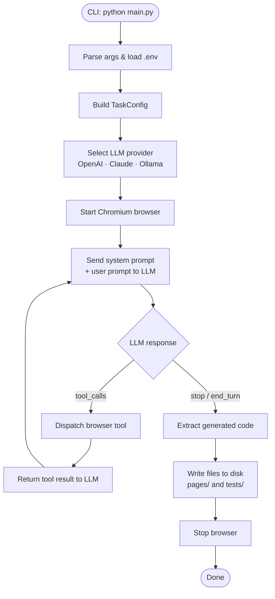
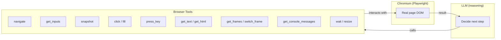
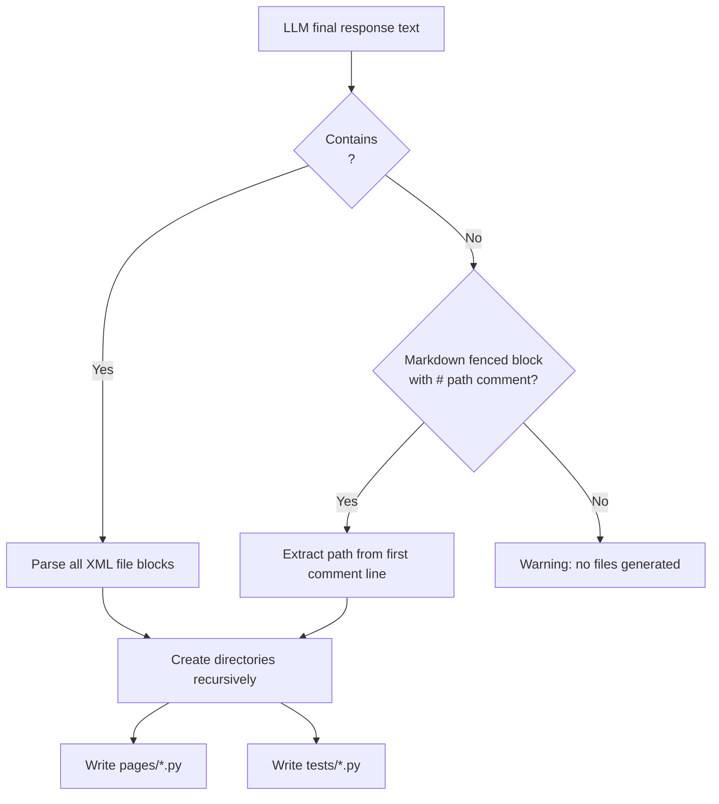
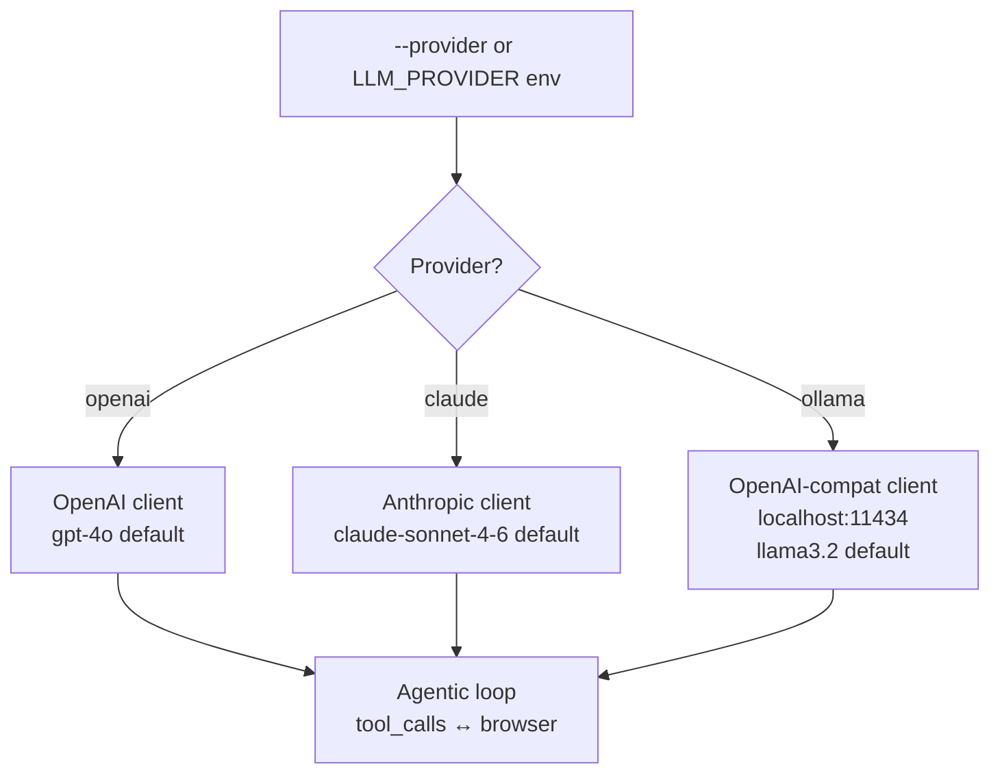

# agentic-qa-playwright-mcp

[](LICENSE)
[](https://www.python.org/)
[](https://playwright.dev/)
[](https://github.com/guilhermefabio/agentic-qa-playwright-mcp/actions/workflows/lint.yml)

AI-powered browser automation framework that generates complete Playwright test suites — Page Object Model + pytest — from plain-text prompts. Supports OpenAI, Anthropic Claude and Ollama out of the box.

---

## Table of Contents

- [Overview](#overview)
- [How it works](#how-it-works)
- [Repository structure](#repository-structure)
- [Quick start](#quick-start)
- [CLI reference](#cli-reference)
- [LLM providers](#llm-providers)
- [Browser tools](#browser-tools)
- [Generated output](#generated-output)
- [Running generated tests](#running-generated-tests)
- [Code quality](#code-quality)
- [Advanced usage](#advanced-usage)
- [Environment variables](#environment-variables)
- [License](#license)

---

## Como funciona na prática — guia para quem não é programador

> Esta seção explica o funcionamento do projeto em linguagem simples, com analogias e ilustrações. Se você já conhece a parte técnica, pode pular direto para [Overview](#overview).

### A analogia: um assistente que aprende a testar sites

Imagine que você precisa testar se o login de um sistema funciona corretamente. Normalmente, você contrataria um QA (pessoa especialista em testes) para fazer isso. Esse profissional vai:

1. Abrir o navegador manualmente
2. Olhar a tela e identificar os campos ("aqui tem um campo de usuário, ali tem senha")
3. Preencher os dados de teste e clicar em "Entrar"
4. Verificar se foi para a página certa
5. Escrever um roteiro documentando o que fez, para que qualquer outro programador consiga repetir o teste automaticamente

**Este projeto faz exatamente isso — só que com Inteligência Artificial no lugar do QA humano.**

---

### A jornada completa em 5 etapas

```
┌─────────────────────────────────────────────────────────────────┐
│                                                                 │
│   VOCÊ digita uma instrução em linguagem natural                │
│   Ex: "Faça login e navegue até o painel de controle"          │
│                                                                 │
└───────────────────────────┬─────────────────────────────────────┘
                            │
                            ▼
┌─────────────────────────────────────────────────────────────────┐
│  ETAPA 1 — Configuração                                         │
│                                                                 │
│  O sistema lê o arquivo .env com as informações do seu site:    │
│  • URL do site (endereço)                                       │
│  • Usuário e senha para login                                   │
│  • Qual IA usar (OpenAI, Claude ou Ollama)                      │
│                                                                 │
└───────────────────────────┬─────────────────────────────────────┘
                            │
                            ▼
┌─────────────────────────────────────────────────────────────────┐
│  ETAPA 2 — O navegador abre                                     │
│                                                                 │
│  Um navegador Chromium real é iniciado (pode aparecer           │
│  na tela ou rodar invisível em segundo plano).                  │
│  O site é acessado automaticamente.                             │
│                                                                 │
└───────────────────────────┬─────────────────────────────────────┘
                            │
                            ▼
┌─────────────────────────────────────────────────────────────────┐
│  ETAPA 3 — A IA "lê" a página e age (loop inteligente)         │
│                                                                 │
│  ┌──────────────┐    pergunta     ┌──────────────────────────┐  │
│  │              │ ─────────────► │                          │  │
│  │   IA (LLM)   │                │   Ferramentas de Browser │  │
│  │  raciocina   │ ◄───────────── │  • Inspecionar campos    │  │
│  │  e decide    │   resposta     │  • Clicar botões         │  │
│  │              │                │  • Preencher formulários │  │
│  └──────────────┘                │  • Tirar "foto" da tela  │  │
│         │                        └──────────────────────────┘  │
│         │                                    │                  │
│         │          O navegador executa       │                  │
│         └────────────────────────────────────┘                  │
│                                                                 │
│  Esse ciclo se repete até a tarefa estar completa.              │
│  A IA nunca "chuta" um campo — ela SEMPRE inspeciona            │
│  a página antes de preencher qualquer coisa.                    │
│                                                                 │
└───────────────────────────┬─────────────────────────────────────┘
                            │
                            ▼
┌─────────────────────────────────────────────────────────────────┐
│  ETAPA 4 — O código de teste é gerado                           │
│                                                                 │
│  Com base no que fez, a IA escreve dois tipos de arquivo:       │
│                                                                 │
│  pages/login_page.py  ──►  "Como navegar na tela de login"     │
│  tests/test_login.py  ──►  "O teste que verifica o login"      │
│                                                                 │
│  Esses arquivos usam o padrão Page Object Model (POM):          │
│  separa "como mexer no site" de "o que verificar no teste".     │
│                                                                 │
└───────────────────────────┬─────────────────────────────────────┘
                            │
                            ▼
┌─────────────────────────────────────────────────────────────────┐
│  ETAPA 5 — Você revisa e roda os testes                         │
│                                                                 │
│  $ pytest                                                       │
│                                                                 │
│  O pytest executa os arquivos gerados.                          │
│  Se o login funcionar ✔  o teste passa (verde).                 │
│  Se algo estiver errado ✖  o teste falha e avisa você.          │
│                                                                 │
└─────────────────────────────────────────────────────────────────┘
```

---

### O que acontece por dentro quando você digita um comando?

Veja um exemplo concreto. Você digita:

```bash
python main.py "Fazer login e ir até o dashboard"
```

O que acontece nos bastidores:

| # | O que ocorre | Quem faz |
|---|---|---|
| 1 | O programa lê o `.env` e descobre a URL, usuário, senha e qual IA usar | `main.py` + `config.py` |
| 2 | Um navegador Chromium abre e acessa o site | `browser.py` (Playwright) |
| 3 | Sua instrução é enviada para a IA com um contexto completo de o que ela pode fazer | `runner.py` + `prompts.py` |
| 4 | A IA responde: "Preciso ver os campos da página" → chama `browser_get_inputs` | IA (LLM) |
| 5 | O sistema lista todos os campos visíveis: `id="username"`, `id="password"`, botão "Entrar" | `tools.py` + `browser.py` |
| 6 | A IA responde: "Agora preencho o usuário" → chama `browser_fill` | IA (LLM) |
| 7 | O campo de usuário é preenchido no navegador real | `browser.py` (Playwright) |
| 8 | Isso se repete para senha, clique no botão, verificação da URL final | Loop entre IA e browser |
| 9 | A IA encerra a tarefa e escreve o código como `<file path="pages/...">...</file>` | IA (LLM) |
| 10 | O código é extraído e salvo nos arquivos `.py` corretos | `writer.py` |

---

### Por que isso é melhor do que escrever testes à mão?

| Problema ao escrever testes manualmente | Como este projeto resolve |
|---|---|
| Precisa saber programar Playwright | Basta descrever o fluxo em texto |
| Seletores CSS quebram quando o HTML muda | A IA usa seletores semânticos (por rótulo, papel, texto) — mais estáveis |
| Horas para criar um teste simples | Minutos para gerar um conjunto completo |
| Fácil esquecer de testar um campo | A IA inspeciona todos os campos da página automaticamente |
| Difícil manter testes com o site evoluindo | Basta rodar o gerador de novo com a mesma instrução |

---

### Glossário rápido para leigos

| Termo | O que significa na prática |
|---|---|
| **Playwright** | A ferramenta que controla o navegador automaticamente (como um "piloto automático" para o Chrome) |
| **pytest** | O programa que roda os testes e diz se passaram ou falharam |
| **Page Object Model (POM)** | Uma forma de organizar o código: um arquivo descreve a página, outro arquivo descreve o teste. Facilita manutenção. |
| **LLM / IA** | O modelo de linguagem (GPT-4, Claude etc.) que entende sua instrução e decide o que fazer |
| **Headless** | O navegador roda sem janela visível — mais rápido, útil em servidores |
| **`.env`** | Arquivo de configuração com suas senhas e URLs — nunca é enviado ao Git |
| **Tool call** | A IA "pede" ao sistema para executar uma ação no navegador (clicar, preencher, tirar snapshot) |

---

## Overview

Describe a user flow in natural language. The agent:

1. Opens a **real Chromium browser** (visible or headless)
2. Navigates to your application
3. Inspects the **live DOM** — field ids, names, labels, roles — before touching anything
4. Executes the flow step-by-step, taking accessibility snapshots after each action
5. Writes **Page Object Model classes** + **pytest test files** based on what it actually found

No manual selector hunting. No brittle CSS hardcoding.

---

## How it works

### Agent execution loop



### Browser interaction flow



### File generation flow



### LLM provider selection



---

## Repository structure

```
agentic-qa-playwright-mcp/
├── .github/
│   └── workflows/
│       └── lint.yml            # CI: ruff + mypy + pip-audit on push/PR
├── .pre-commit-config.yaml     # Local git commit hooks
├── pyproject.toml              # Root package metadata + ruff/mypy config
├── README.md
├── LICENSE
└── agent_browser/              # Runnable application
    ├── main.py                 # CLI entry point (argparse + asyncio)
    ├── conftest.py             # pytest session-scoped `config` fixture
    ├── pytest.ini              # pytest config (browser: chromium, testpaths: tests/)
    ├── .env.example            # Template — copy to .env and fill in
    ├── pyproject.toml          # Package deps (playwright, openai, anthropic…)
    ├── requirements.txt        # pip-installable dep list
    ├── agent/
    │   ├── browser.py          # Browser class — async Playwright actions
    │   ├── tools.py            # Tool schemas (OpenAI + Anthropic) & dispatcher
    │   ├── prompts.py          # System prompt builder
    │   ├── runner.py           # TaskConfig dataclass + per-provider agent loops
    │   └── writer.py           # Parses LLM output and writes files to disk
    └── utils/
        └── config.py           # Config class — reads BASE_URL, LOGIN_USER, LOGIN_PASSWORD
```

---

## Quick start

```bash
cd agent_browser

# 1. Create and activate virtualenv
python -m venv .venv
.venv\Scripts\activate        # Windows
# source .venv/bin/activate   # Linux / macOS

# 2. Install dependencies
pip install -r requirements.txt
playwright install chromium

# 3. Configure
cp .env.example .env
# Edit .env with your app URL, credentials and API key
```

Minimal `.env`:

```env
BASE_URL=https://your-app/login
LOGIN_USER=admin
LOGIN_PASSWORD=secret

LLM_PROVIDER=openai
OPENAI_API_KEY=sk-...
```

Run the generator:

```bash
python main.py "Login and navigate to the dashboard"
```

The agent opens a browser, inspects the live DOM, executes the flow, and writes `pages/` + `tests/` to disk.

---

## CLI reference

```
python main.py <PROMPT> [OPTIONS]
```

| Argument | Flag | Description |
|---|---|---|
| `PROMPT` | positional | Natural language description of the flow to automate |
| URL | `--url URL` | Base URL (overrides `BASE_URL` from `.env`) |
| User | `--user USER` | Login username (overrides `LOGIN_USER`) |
| Password | `--password PASS` | Login password (overrides `LOGIN_PASSWORD`) |
| Provider | `--provider {openai,claude,ollama}` | LLM provider (overrides `LLM_PROVIDER`) |
| Model | `--model MODEL` | Specific model name (overrides `LLM_MODEL`) |
| Headless | `--headless` | Run browser without visible window |
| Output | `--output DIR` / `-o DIR` | Directory to write generated files (default: `.`) |
| Context | `--context TEXT` / `-c TEXT` | Extra context about the site (routing, framework, quirks) |

### Examples

```bash
# Basic login flow (reads URL and credentials from .env)
python main.py "Login and navigate to dashboard"

# Override credentials inline
python main.py "Login and check audit list" \
  --url https://myapp.com/login \
  --user admin --password secret123

# Use Claude, headless, save to a custom folder
python main.py "Checkout flow" \
  --provider claude \
  --headless \
  --output ./generated

# Extra context to help the agent navigate a SPA
python main.py "Create a new report" \
  --context "After login the app redirects to /dashboard. Sidebar has a 'Reports' entry. Uses React SPA."

# Use a local Ollama model
python main.py "Test login" \
  --provider ollama \
  --model llama3.2
```

---

## LLM providers

| `LLM_PROVIDER` | Default model | Required env var |
|---|---|---|
| `openai` (default) | `gpt-4o` | `OPENAI_API_KEY` |
| `claude` | `claude-sonnet-4-6` | `ANTHROPIC_API_KEY` |
| `ollama` | `llama3.2` | Ollama running locally; `OLLAMA_BASE_URL` (default `http://localhost:11434/v1`) |

Override the model for any provider:

```env
LLM_MODEL=gpt-4o-mini
```

```bash
python main.py "..." --provider claude --model claude-opus-4-8
```

Both OpenAI and Ollama share the same `_run_openai_compat` loop (OpenAI-compatible API). Claude uses `_run_anthropic` with the Anthropic SDK. Both loops share the same `Browser` instance and tool dispatcher.

---

## Browser tools

The LLM has the following tools available. It decides which to call and when, but is instructed to **always call `browser_get_inputs` before filling any field** — selectors are never guessed.

### Navigation

| Tool | Description |
|---|---|
| `browser_navigate` | Go to a URL, waits for `networkidle` |
| `browser_navigate_back` | Go back in history |
| `browser_navigate_forward` | Go forward in history |
| `browser_reload` | Reload the current page |
| `browser_get_url` | Return the current page URL |

### Inspection

| Tool | Description |
|---|---|
| `browser_get_inputs` | List all visible `input`, `textarea`, `select` with real `id`, `name`, `type`, `placeholder`, `label` |
| `browser_snapshot` | Accessibility tree (roles, names, states) — used after every important action |
| `browser_get_text` | All visible text from `<body>` (up to 4 000 chars) |
| `browser_get_html` | Inner HTML of a CSS selector (up to 6 000 chars) |
| `browser_get_console_messages` | Browser console log (errors, warnings, info) |

### Frames

| Tool | Description |
|---|---|
| `browser_get_frames` | List all frames with index, name, URL |
| `browser_switch_frame` | Switch active context to a frame (by index, name, or URL substring) |
| `browser_switch_main_frame` | Return to the main page context |

### Interaction

| Tool | Description |
|---|---|
| `browser_click` | Click an element by selector; waits for `networkidle` |
| `browser_fill` | Fill a form field; waits for element to be visible first |
| `browser_type_text` | Type character by character (useful when `fill` bypasses JS input events) |
| `browser_fill_form` | Fill multiple fields in one call |
| `browser_press_key` | Press a key (`Enter`, `Tab`, `Escape`, etc.) |
| `browser_wait` | Wait N milliseconds (animations, dropdowns) |
| `browser_resize` | Resize the browser viewport |

### Timeouts and content limits

Defined as module-level constants in `browser.py`:

| Constant | Value | Used for |
|---|---|---|
| `_TIMEOUT_NAVIGATE` | 30 000 ms | `page.goto()` |
| `_TIMEOUT_CLICK` | 10 000 ms | `locator.click()`, `wait_for(visible)` |
| `_TIMEOUT_LOAD` | 15 000 ms | `wait_for_load_state("networkidle")` |
| `_SNAPSHOT_LIMIT` | 8 000 chars | Accessibility tree truncation |
| `_TEXT_LIMIT` | 4 000 chars | `get_text()` truncation |
| `_HTML_LIMIT` | 6 000 chars | `get_html()` truncation |
| `_CONSOLE_LIMIT` | 100 entries | Max console messages kept in memory |

---

## Generated output

The agent produces files in the **Page Object Model** pattern:

```
pages/
├── login_page.py
└── dashboard_page.py

tests/
├── test_login.py
└── test_dashboard.py
```

### Page object example

```python
# pages/login_page.py
from playwright.sync_api import Page
from utils.config import Config

class LoginPage:
    def __init__(self, page: Page, config: Config):
        self.page = page
        self.config = config

    def navigate(self):
        self.page.goto(self.config.base_url)

    def login(self):
        self.page.get_by_label("Username").fill(self.config.login_user)
        self.page.get_by_label("Password").fill(self.config.login_password)
        self.page.get_by_role("button", name="Sign in", exact=True).click()
```

### Test example

```python
# tests/test_login.py
from playwright.sync_api import Page
from utils.config import Config
from pages.login_page import LoginPage

def test_login(page: Page, config: Config):
    lp = LoginPage(page, config)
    lp.navigate()
    lp.login()
    page.wait_for_url("**/dashboard")
```

### Locator priority (enforced in the system prompt)

1. `get_by_role(exact=True)`
2. `get_by_label`
3. `get_by_text(exact=True)`
4. `.first` when there is ambiguity

> `pages/` and `tests/` are in `.gitignore`. Review the generated files and commit them once you have approved them.

---

## Running generated tests

```bash
# From agent_browser/
pytest                          # all tests, headless (chromium)
pytest --headed                 # visible browser
pytest tests/test_login.py -v   # specific test, verbose
```

`conftest.py` provides a session-scoped `config` fixture that reads `.env`:

```python
@pytest.fixture(scope="session")
def config() -> Config:
    return Config()
```

Tests receive `page: Page` from `pytest-playwright` and `config: Config` from the above fixture.

---

## Code quality

### Pre-commit hooks

Install once after cloning:

```bash
pip install pre-commit
pre-commit install
```

From then on, every `git commit` automatically runs:

| Hook | What it checks |
|---|---|
| `trailing-whitespace` | Trailing spaces in any file |
| `end-of-file-fixer` | Ensures files end with a newline |
| `check-yaml` / `check-toml` | Syntax of config files |
| `check-merge-conflict` | Leftover merge conflict markers |
| `debug-statements` | `pdb` / `breakpoint()` left in code |
| `ruff` (lint) | PEP 8, unused imports, bugbear, pyupgrade — auto-fixes with `--fix` |
| `ruff-format` | Code formatting (replaces black) |
| `mypy` | Static type checking |
| `pip-audit` | Dependency vulnerability scan (runs only when `requirements.txt` changes) |

Run manually against all files at any time:

```bash
pre-commit run --all-files
```

### GitHub Actions CI

`.github/workflows/lint.yml` runs the same checks on every push to `main`/`dev` and on every pull request:

```
Lint & Validate
├── Ruff lint          (ruff check)
├── Ruff format check  (ruff format --check)
├── Mypy type check
└── pip-audit          (dependency CVE scan)
```

Linting rules are configured in the root `pyproject.toml` under `[tool.ruff]` and `[tool.mypy]`.

---

## Advanced usage

### Extra context (`--context`)

Pass free-form text about your app so the agent does not waste turns guessing navigation:

```bash
python main.py "Create a purchase order" \
  --context "Single-page React app. After login goes to /home. PO form is under Menu > Purchases > New PO. Fields use custom Angular components."
```

### Custom output directory

```bash
python main.py "Onboarding flow" --output ./tests/e2e
```

Generated `pages/` and `tests/` will be written inside `./tests/e2e/`.

### Multi-frame pages

If your app uses iframes, the agent can list all frames and switch context:

```
browser_get_frames  → [{index: 0, name: "main", ...}, {index: 1, name: "embed", ...}]
browser_switch_frame(index=1)
browser_get_inputs  → (inspects inside the iframe)
browser_fill(...)
browser_switch_main_frame
```

### Max tokens

`runner.py` sets `_MAX_TOKENS = 8_096` for all LLM responses. Increase this constant if the agent truncates on complex flows.

---

## Environment variables

| Variable | Required | Description |
|---|---|---|
| `BASE_URL` | Yes (for tests) | Application URL (e.g. `https://myapp.com/login`) |
| `LOGIN_USER` | Yes (for tests) | Login username |
| `LOGIN_PASSWORD` | Yes (for tests) | Login password |
| `LLM_PROVIDER` | No (default: `openai`) | `openai` \| `claude` \| `ollama` |
| `LLM_MODEL` | No | Override default model for the chosen provider |
| `OPENAI_API_KEY` | If using `openai` | OpenAI API key |
| `ANTHROPIC_API_KEY` | If using `claude` | Anthropic API key |
| `OLLAMA_BASE_URL` | If using `ollama` | Default: `http://localhost:11434/v1` |

Copy `.env.example` to `.env` and fill in the values. The `.env` file is git-ignored.

---

## License

[MIT](LICENSE) © 2026 Guilherme Fabio Vieira
